# Assessment 02 - Kubernetes, MetalLB y Traefik

## Información general

En esta práctica se configuró un clúster local de Kubernetes utilizando Minikube con el objetivo de publicar cuatro aplicaciones web mediante una única dirección IP.

Para lograrlo se utilizaron las siguientes tecnologías:

- Kubernetes
- Minikube
- Docker
- MetalLB
- Traefik
- Helm
- NGINX
- Windows Hosts

La arquitectura implementada permite acceder a cuatro aplicaciones diferentes mediante distintos nombres de dominio, mientras todas comparten una única dirección IP asignada al servicio `LoadBalancer` de Traefik.

---

# Arquitectura

La arquitectura general implementada se muestra en el siguiente diagrama:

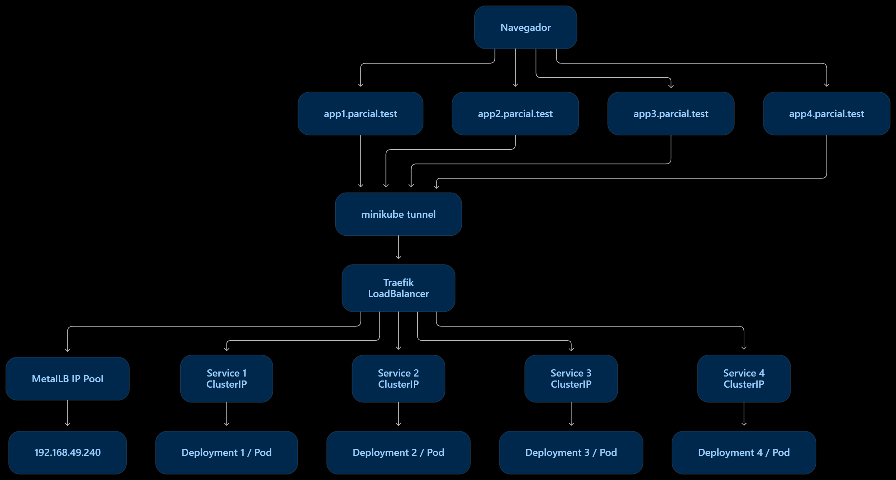

Traefik funciona como Ingress Controller y recibe las solicitudes HTTP dirigidas a los cuatro nombres de dominio.

MetalLB proporciona una única dirección IP al servicio `LoadBalancer` de Traefik.

Los cuatro servicios de las aplicaciones utilizan el tipo `ClusterIP`, por lo que permanecen internos dentro del clúster y son expuestos mediante Traefik.

---

# 1. Verificación inicial de Minikube

Primero se verificó que el clúster de Minikube estuviera funcionando correctamente.

Comandos utilizados:

```powershell
minikube status
kubectl get nodes
kubectl get namespaces
```

El nodo `minikube` se encontraba en estado `Ready` y los componentes principales del clúster estaban funcionando correctamente.

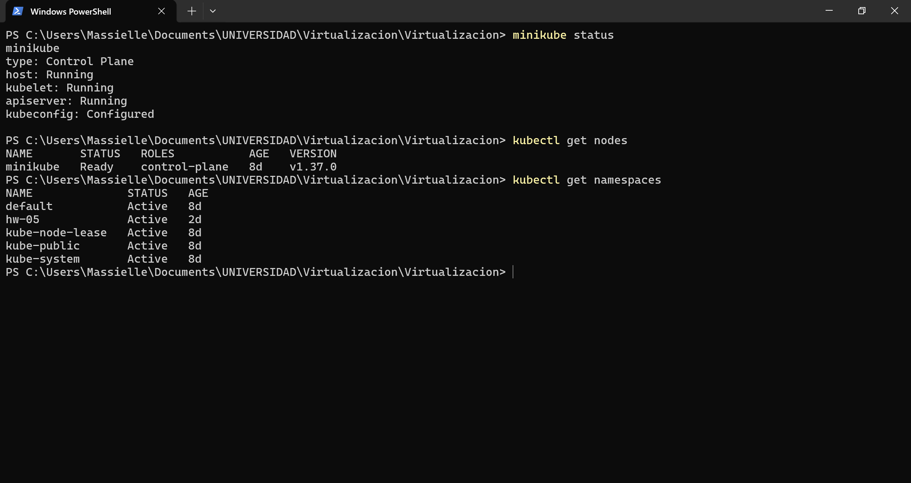

---

# 2. Creación de namespaces

Para mantener los recursos separados se utilizaron diferentes namespaces.

Se crearon los siguientes:

```text
metallb-system
traefik
parcial-amcr
```

El namespace `metallb-system` contiene los componentes de MetalLB.

El namespace `traefik` contiene el Ingress Controller Traefik.

El namespace `parcial-amcr` contiene los cuatro Deployments, Services e Ingress de las aplicaciones.

Comandos utilizados:

```powershell
kubectl create namespace metallb-system
kubectl create namespace traefik
kubectl create namespace parcial-amcr
```

Para verificar:

```powershell
kubectl get namespaces
```

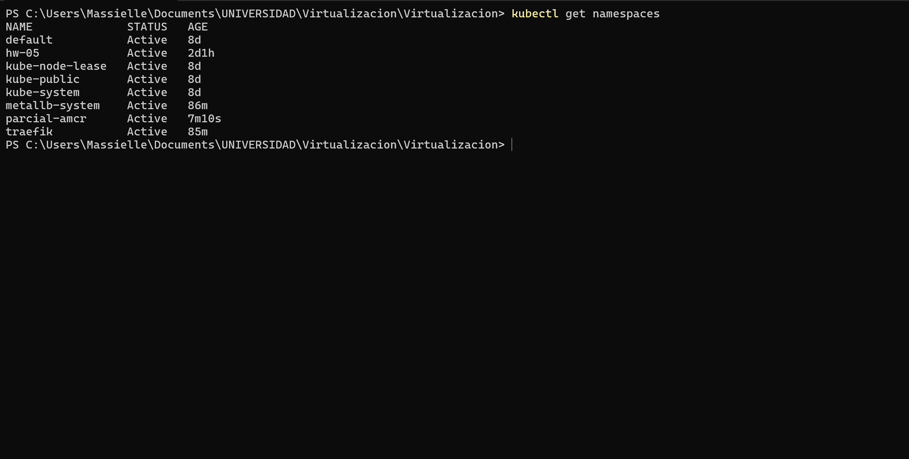

---

# 3. Instalación de MetalLB

MetalLB fue instalado mediante Helm.

Primero se agregó el repositorio:

```powershell
helm repo add metallb https://metallb.github.io/metallb
helm repo update
```

Luego se configuraron los permisos necesarios para el namespace:

```powershell
kubectl label namespace metallb-system pod-security.kubernetes.io/enforce=privileged --overwrite
kubectl label namespace metallb-system pod-security.kubernetes.io/audit=privileged --overwrite
kubectl label namespace metallb-system pod-security.kubernetes.io/warn=privileged --overwrite
```

Finalmente se realizó la instalación:

```powershell
helm install metallb metallb/metallb --namespace metallb-system
```

Se verificó la instalación mediante:

```powershell
helm list -n metallb-system
kubectl get pods -n metallb-system -o wide
```

Todos los componentes de MetalLB se encontraron en estado `Running`.

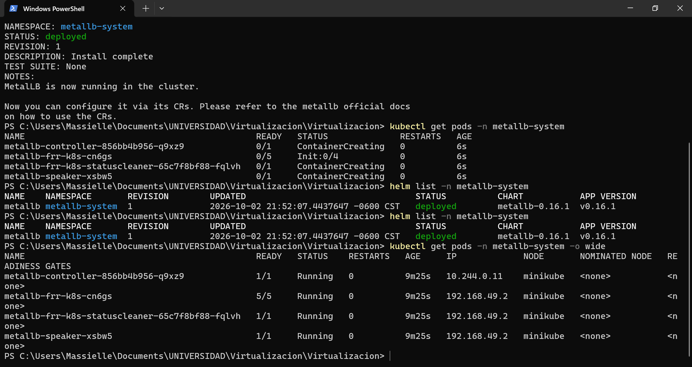

---

# 4. Configuración de IP de MetalLB

Se configuró un `IPAddressPool` utilizando una única dirección IP:

```text
192.168.49.240
```

El archivo de configuración utilizado fue `metallb/metallb-config.yaml`.

```yaml
apiVersion: metallb.io/v1beta1
kind: IPAddressPool
metadata:
  name: parcial-pool
  namespace: metallb-system
spec:
  addresses:
    - 192.168.49.240-192.168.49.240

---
apiVersion: metallb.io/v1beta1
kind: L2Advertisement
metadata:
  name: parcial-l2
  namespace: metallb-system
spec:
  ipAddressPools:
    - parcial-pool
```

La configuración fue aplicada mediante:

```powershell
kubectl apply -f .\metallb\metallb-config.yaml
```

Para verificar:

```powershell
kubectl get ipaddresspools -n metallb-system
kubectl get l2advertisements -n metallb-system
kubectl describe ipaddresspool parcial-pool -n metallb-system
```

El resultado mostró una dirección IPv4 disponible para asignar.

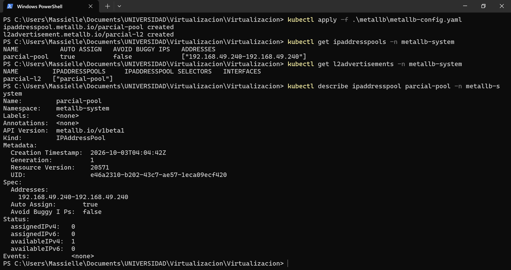

---

# 5. Instalación y configuración de Traefik

Traefik fue instalado utilizando Helm.

Se agregó su repositorio:

```powershell
helm repo add traefik https://traefik.github.io/charts
helm repo update
```

Se creó el archivo `traefik/values.yaml` con la siguiente configuración:

```yaml
service:
  enabled: true
  type: LoadBalancer

providers:
  kubernetesIngress:
    enabled: true

ingressClass:
  enabled: true
  isDefaultClass: false
```

Traefik fue instalado mediante:

```powershell
helm install traefik traefik/traefik --namespace traefik -f .\traefik\values.yaml
```

Se verificó con:

```powershell
helm list -n traefik
kubectl get pods -n traefik
kubectl get svc -n traefik
```

MetalLB asignó correctamente la dirección `192.168.49.240` al servicio `LoadBalancer` de Traefik.

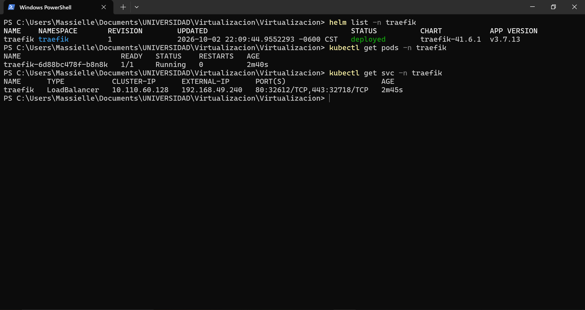

---

# 6. Creación de aplicaciones y servicios

Se generaron cuatro aplicaciones web utilizando NGINX.

Cada aplicación posee:

- Un ConfigMap.
- Un Deployment.
- Un Service.

Los Deployments creados fueron:

```text
app1
app2
app3
app4
```

Los Services creados fueron:

```text
app1-service
app2-service
app3-service
app4-service
```

Todos los Services utilizan el tipo:

```yaml
type: ClusterIP
```

Esto permite que únicamente Traefik sea el servicio expuesto mediante `LoadBalancer`.

La configuración se encuentra en `apps/applications.yaml` y fue aplicada mediante:

```powershell
kubectl apply -f .\apps\applications.yaml
```

Se verificó utilizando:

```powershell
kubectl get deployments -n parcial-amcr
kubectl get pods -n parcial-amcr
kubectl get svc -n parcial-amcr
```

Los cuatro Deployments quedaron disponibles y todos los Pods se encontraron en estado `Running`.

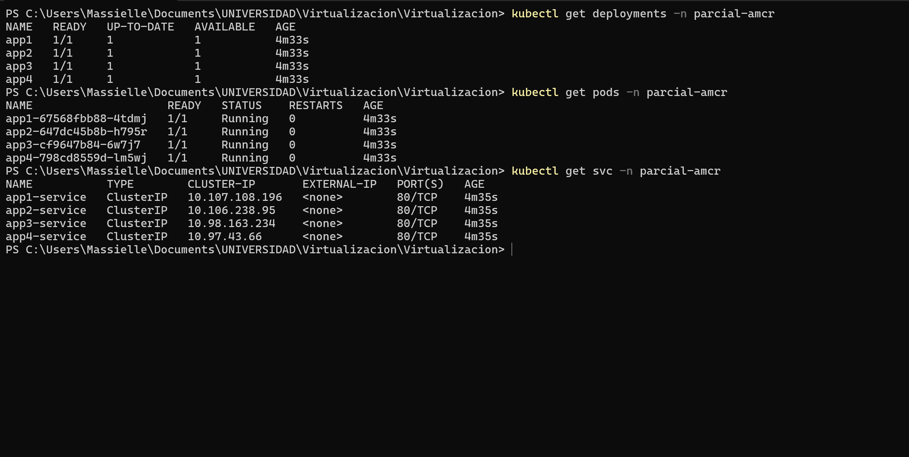

---

# 7. Configuración de Ingress con Traefik

Se crearon cuatro recursos Ingress para permitir que Traefik redirigiera las solicitudes dependiendo del nombre del host.

Los dominios utilizados fueron:

```text
app1.parcial.test
app2.parcial.test
app3.parcial.test
app4.parcial.test
```

La configuración se encuentra en `apps/ingress.yaml`.

Ejemplo de una de las reglas:

```yaml
apiVersion: networking.k8s.io/v1
kind: Ingress
metadata:
  name: app1-ingress
  namespace: parcial-amcr
spec:
  ingressClassName: traefik
  rules:
    - host: app1.parcial.test
      http:
        paths:
          - path: /
            pathType: Prefix
            backend:
              service:
                name: app1-service
                port:
                  number: 80
```

El archivo fue aplicado mediante:

```powershell
kubectl apply -f .\apps\ingress.yaml
```

La configuración fue verificada mediante:

```powershell
kubectl get ingress -n parcial-amcr
```

Los cuatro Ingress utilizaron la dirección asignada por MetalLB:

```text
192.168.49.240
```

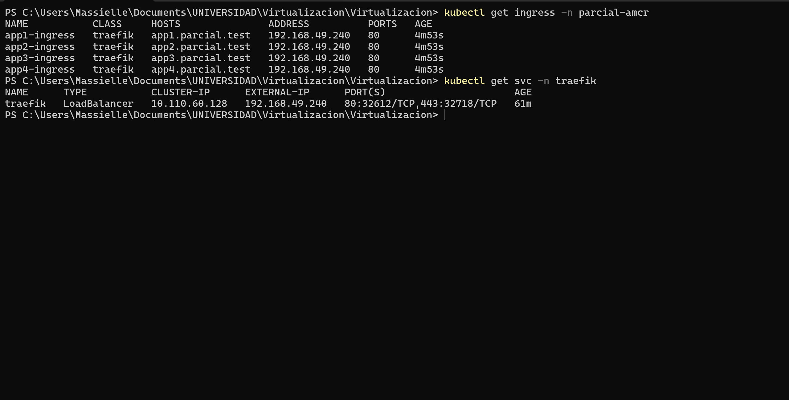

---

# 8. Configuración de DNS local

Debido a que no era necesario adquirir un dominio real, se utilizaron nombres de dominio locales.

En Windows se modificó el archivo:

```text
C:\Windows\System32\drivers\etc\hosts
```

La dirección externa proporcionada por MetalLB dentro del clúster fue:

```text
192.168.49.240
```

Debido a que Minikube está siendo ejecutado utilizando Docker sobre Windows, se utilizó `minikube tunnel` para permitir el acceso desde el host hacia los servicios del clúster.

El túnel fue iniciado mediante:

```powershell
minikube tunnel
```

Para el acceso desde Windows se configuraron los siguientes nombres en el archivo `hosts`:

```text
127.0.0.1 app1.parcial.test
127.0.0.1 app2.parcial.test
127.0.0.1 app3.parcial.test
127.0.0.1 app4.parcial.test
```

Después de modificar el archivo se limpió la caché DNS:

```powershell
ipconfig /flushdns
```

MetalLB continúa asignando `192.168.49.240` al servicio `LoadBalancer` de Traefik; `127.0.0.1` se utiliza en el host Windows como punto de acceso local a través del túnel de Minikube.

---

# 9. Verificación mediante CURL

Antes de probar las aplicaciones en el navegador se realizaron solicitudes HTTP mediante `curl`.

```powershell
curl.exe http://app1.parcial.test
curl.exe http://app2.parcial.test
curl.exe http://app3.parcial.test
curl.exe http://app4.parcial.test
```

Las cuatro solicitudes fueron respondidas correctamente por las aplicaciones correspondientes.

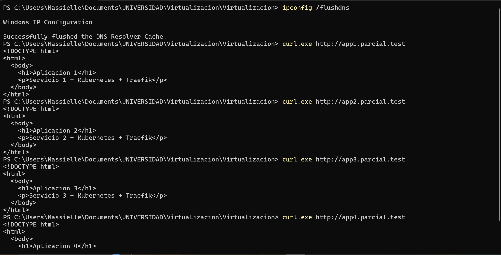

La ruta seguida por una solicitud se muestra en el siguiente diagrama:

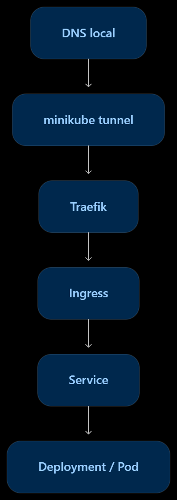

Este flujo permite que una solicitud realizada desde el equipo local sea recibida por Traefik, evaluada mediante las reglas Ingress y enviada al Service y Pod correspondiente.

---

# 10. Prueba desde navegador - Aplicación 1

La primera aplicación fue accedida mediante:

```text
http://app1.parcial.test
```

Traefik identificó el nombre del host y envió la solicitud hacia `app1-service`.

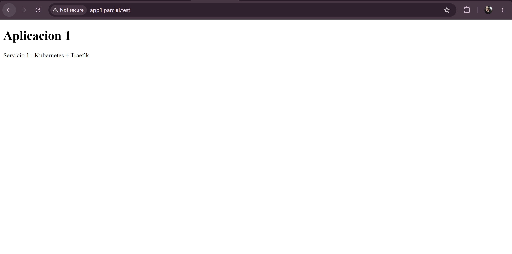

---

# 11. Prueba desde navegador - Aplicación 2

La segunda aplicación fue accedida mediante:

```text
http://app2.parcial.test
```

Traefik dirigió la solicitud hacia `app2-service`.


---

# 12. Prueba desde navegador - Aplicación 3

La tercera aplicación fue accedida mediante:

```text
http://app3.parcial.test
```

Traefik dirigió la solicitud hacia `app3-service`.

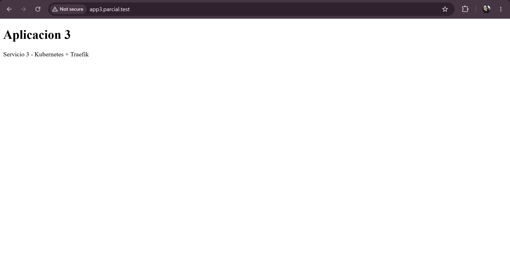

---

# 13. Prueba desde navegador - Aplicación 4

La cuarta aplicación fue accedida mediante:

```text
http://app4.parcial.test
```

Traefik dirigió la solicitud hacia `app4-service`.

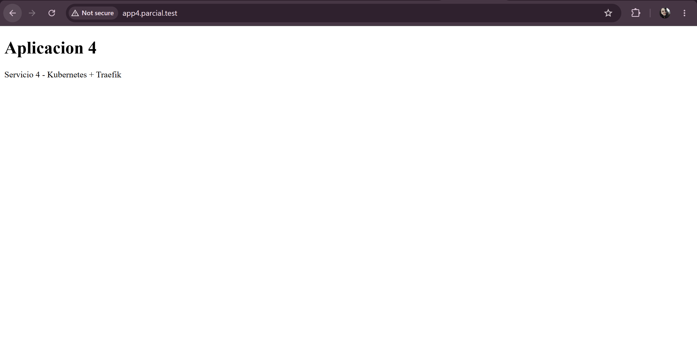

---

# Resultado final

Se implementó una arquitectura Kubernetes con cuatro aplicaciones web expuestas mediante una única dirección IP de LoadBalancer.

La dirección asignada por MetalLB al servicio de Traefik fue:

```text
192.168.49.240
```

Traefik funciona como punto de entrada del clúster y determina el Service destino de acuerdo con el nombre de dominio utilizado.

| Dominio | Service | Deployment |
|---|---|---|
| `app1.parcial.test` | `app1-service` | `app1` |
| `app2.parcial.test` | `app2-service` | `app2` |
| `app3.parcial.test` | `app3-service` | `app3` |
| `app4.parcial.test` | `app4-service` | `app4` |

Los cuatro dominios son administrados mediante el mismo servicio `LoadBalancer` de Traefik, mientras los Services de las aplicaciones permanecen como `ClusterIP`.

---

# Conclusión

Mediante esta práctica se implementó un sistema de exposición y enrutamiento de servicios en Kubernetes utilizando MetalLB y Traefik.

MetalLB permitió proporcionar una dirección IP al servicio `LoadBalancer` de Traefik, mientras que Traefik permitió utilizar múltiples nombres de dominio para acceder a diferentes aplicaciones sin necesidad de asignar una dirección IP independiente a cada una.

Los cuatro Deployments y Services se encuentran dentro del namespace `parcial-amcr`, mientras que MetalLB y Traefik utilizan sus propios namespaces. De esta manera se mantiene la separación de responsabilidades solicitada y se centraliza el acceso a las aplicaciones mediante una única entrada.
